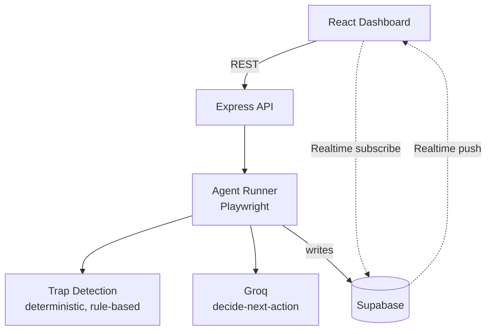

# 🛡️ Warden — AI Bodyguard for Autonomous Agents

**Track 03 — AI Bodyguard: Autonomous Agent Shield · Genesis Fest 2026**

Warden is a runtime security middleware that sits between an autonomous
browsing agent and the live web page it's about to act on. It inspects the
agent's intended action, catches deceptive UI patterns before they execute,
and shows exactly what it caught — in real time.

> Autonomous agents read the web mechanically, off the raw DOM. They don't
> have a human's instinct to distrust a suspicious popup. Warden gives them
> one.

---

## The Problem

As LLMs move from chatbots into autonomous browsing agents, they interact
directly with untrusted web content. Malicious and dark-pattern-heavy pages
exploit exactly what makes an agent different from a human: it reads a page
mechanically, with no built-in suspicion.

- **Fake close buttons** that trigger a download instead of dismissing a modal
- **Pre-checked billing checkboxes** that enroll an agent in a recurring charge
- **Hidden prompt-injection text** invisible to a human but directly in an
  agent's context window, instructing it to abandon its actual goal
- **Artificial urgency banners** pressuring immediate, unconsidered action

Warden inspects every action an agent is about to take against a set of
deterministic rules, **before** it executes — and blocks or reroutes anything
that matches a known deceptive pattern.

---

## How It Works

```
1. Dispatch a run: target URL + mode (shielded / unshielded) + goal
2. Playwright opens an isolated browser, navigates to the target
3. The page's interactive elements are captured into a simplified snapshot
4. Groq decides the next action (click / type / navigate / done)
5. SHIELDED MODE ONLY: the chosen action is checked against the trap
   detection engine before it's allowed to execute
      → flagged  → blocked, logged, agent asked to choose again
      → safe     → proceeds
6. UNSHIELDED MODE: the identical decision executes with no check —
   this is what makes the before/after comparison meaningful
7. Every step is logged and streamed live to the dashboard via
   Supabase Realtime
```

**The core demo:** run the same target twice — once unshielded, once
shielded — and watch the outcome diverge live. That comparison is the
product's entire argument, and it's also exactly what the track spec asks
teams to demonstrate.

---

## Features

### Completed
- Full agent loop: navigate → capture DOM → decide → shield → execute → log
- Deterministic, LLM-free trap detection (fake close button, prechecked
  billing, hidden prompt injection, urgency deception)
- Live Interception Console with correctly-ordered realtime event streaming
- Side-by-side shielded vs. unshielded benchmark comparison
- Real-website support with safety guardrails (URL/SSRF validation, persona
  enforcement, consent-banner dismissal, graceful failure handling)
- Judge Demo Presets — one-click scenario launchers, no typing required live

### Known limitations (see the full status doc for detail)
- One additional detector (fake-CAPTCHA) is implemented but not yet firing
  correctly against its test fixture
- Backend runs locally during the demo, not deployed — Render's free tier
  cannot reliably run headless Chromium

---

## Tech Stack

| Layer | Technology |
|---|---|
| Frontend | React (Vite), Tailwind CSS 3.4.17, shadcn/ui, Aceternity UI, Magic UI |
| State / motion | Zustand, Framer Motion, Lenis |
| Backend | Node.js, Express — strict Controller → Service → Route layering |
| Browser automation | Playwright (headless Chromium) |
| AI inference | Groq — **openai/gpt-oss-20b `backend/.env`** |
| Database / Realtime | Supabase (Postgres, Row Level Security, Realtime) |
| Validation | Zod |
| Hosting | Vercel (frontend) · backend runs locally during the demo |
| Build assistant | Google Antigravity, human-reviewed per file |

---

## Architecture



---

## Getting Started

### Prerequisites
- Node.js 20+
- A Supabase project (URL + anon key + service role key)
- A Groq API key

### Setup

```bash
git clone <this-repo-url>
cd warden

# Backend
cd backend
cp .env.example .env    # fill in GROQ_API_KEY, GROQ_MODEL, SUPABASE_*, etc.
npm install
npx playwright install chromium
npm run dev              # runs on http://localhost:3000

# Frontend (new terminal)
cd ../frontend
cp .env.example .env      # fill in VITE_SUPABASE_URL, VITE_SUPABASE_ANON_KEY
npm install
npm run dev               # runs on http://localhost:5173
```

Open `http://localhost:5173`, pick a Judge Demo Preset, and launch a run.

---

## Project Structure

```
warden/
├── GEMINI.md              # agent rules loaded by Google Antigravity
├── .agents/                # reusable skills and workflows for the build tool
├── backend/
│   └── src/
│       ├── config/         # env validation, Supabase client
│       ├── controllers/    # HTTP layer only
│       ├── services/       # agent-runner, trap-detection, groq — all logic here
│       ├── routes/
│       ├── middlewares/
│       └── validators/
└── frontend/
    └── src/
        ├── pages/           # Dashboard, Traps Catalog, And Runs tab which store the audit log directly 
        ├── lib/
        │   ├── dataProvider.js       # the only import feature code uses
        │   └── providers/
        └── components/
            ├── ui/ aceternity/ magicui/   # vendor components, not hand-edited
            └── motion/ layout/ common/    # ours
```

---

## Team

Shriyan Nandy
Md Hozaifah

---

## Acknowledgments

Built with shadcn/ui, Aceternity UI, and Magic UI as open-source component
libraries. Assisted by Google Antigravity under human-in-the-loop review —
every generated file was read and approved before being committed; see
commit history for the full record.

---

## License

Not yet used

